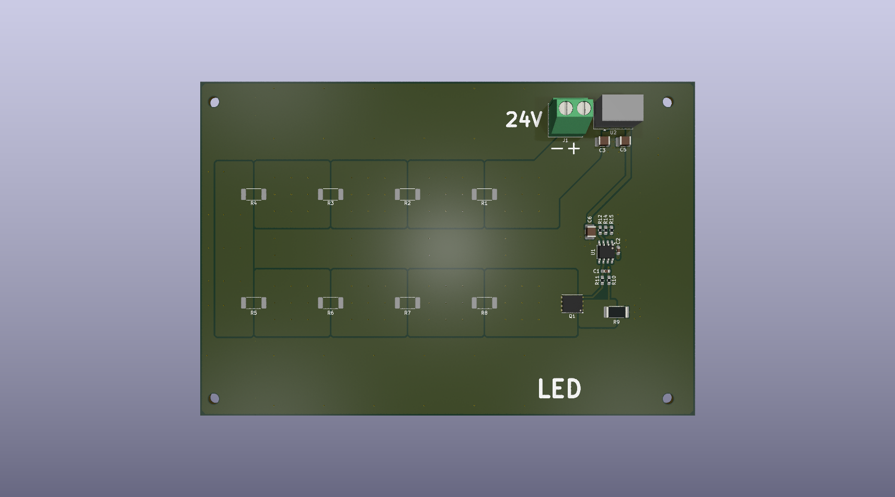
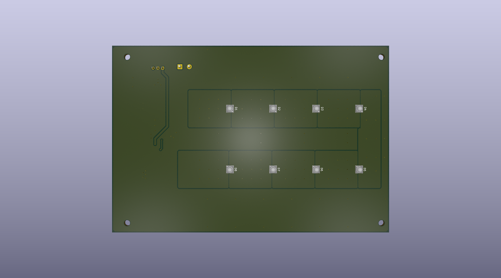
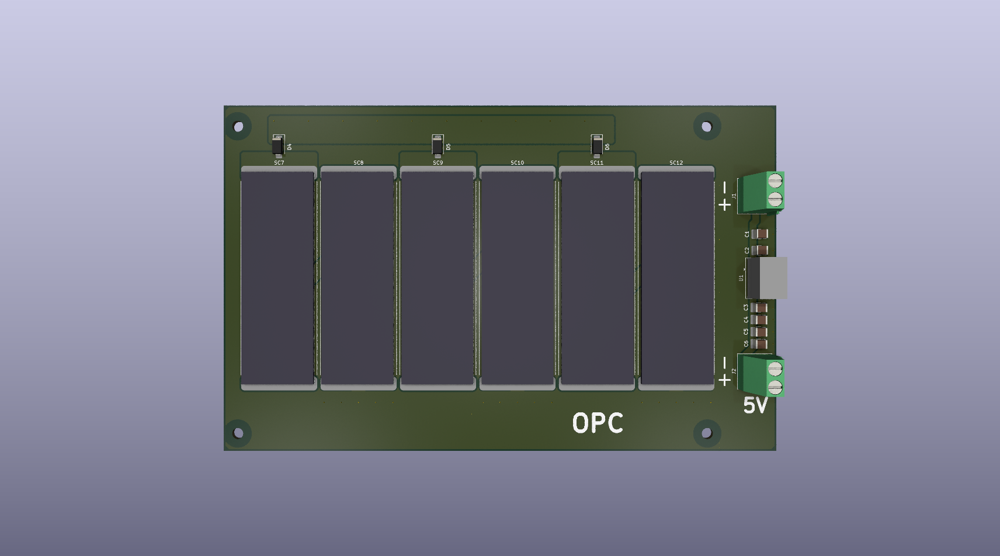
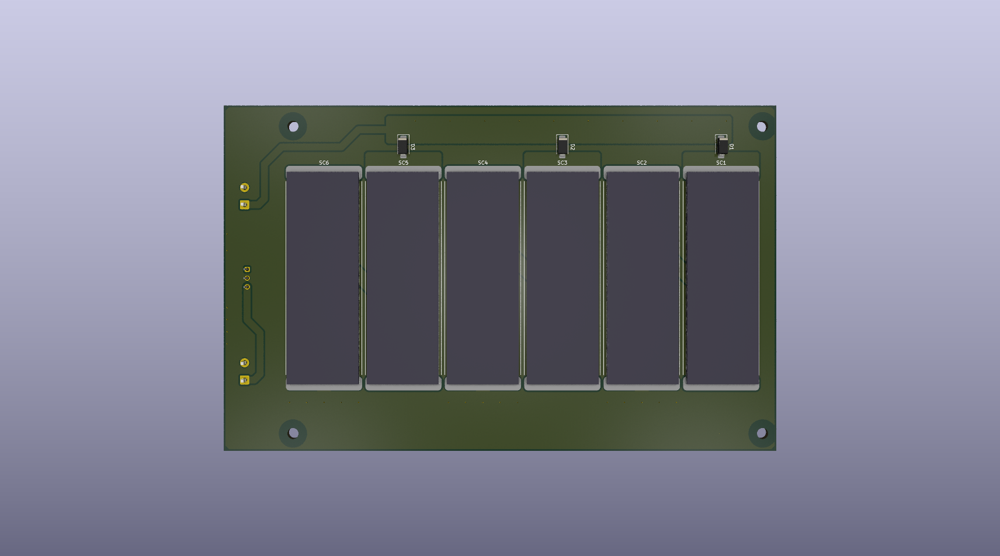
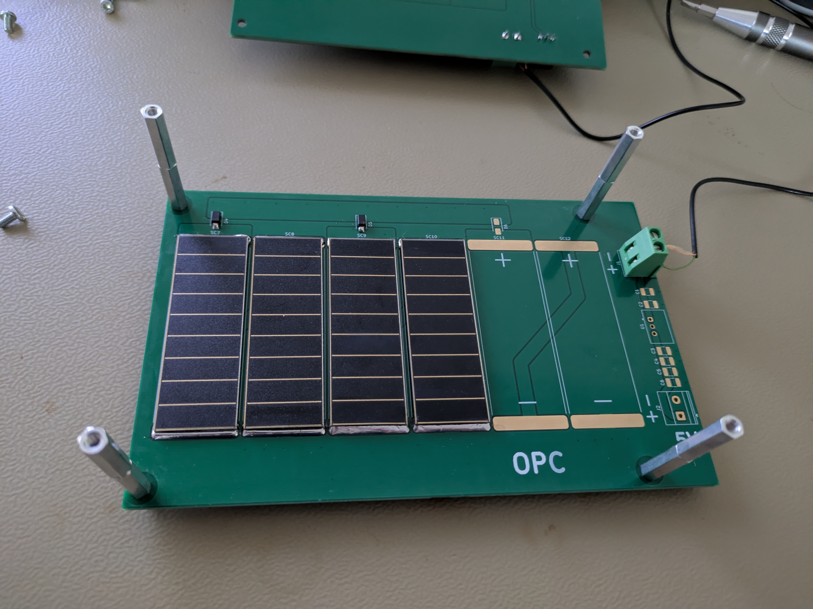
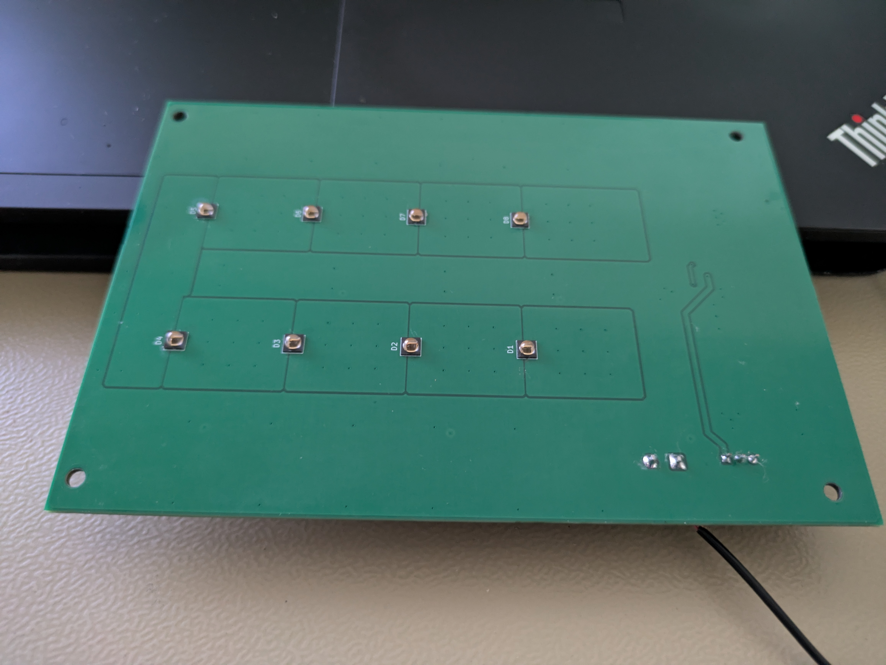
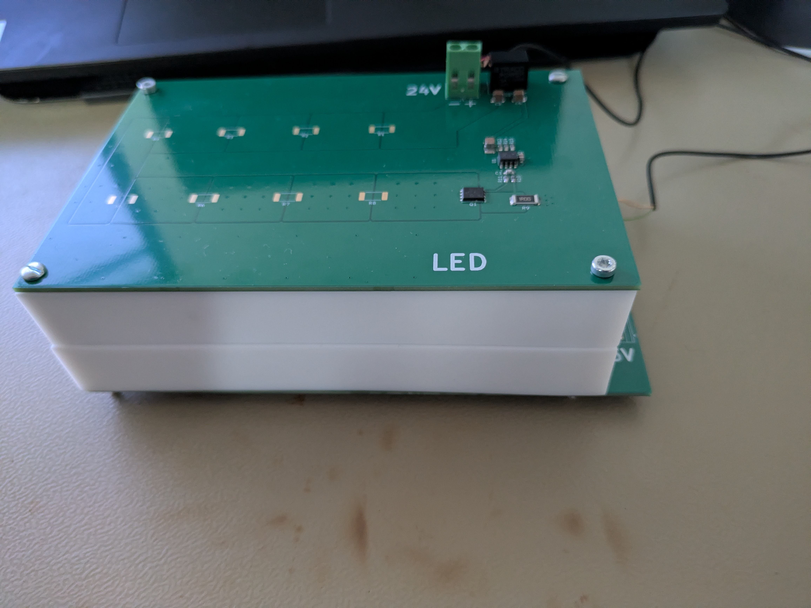
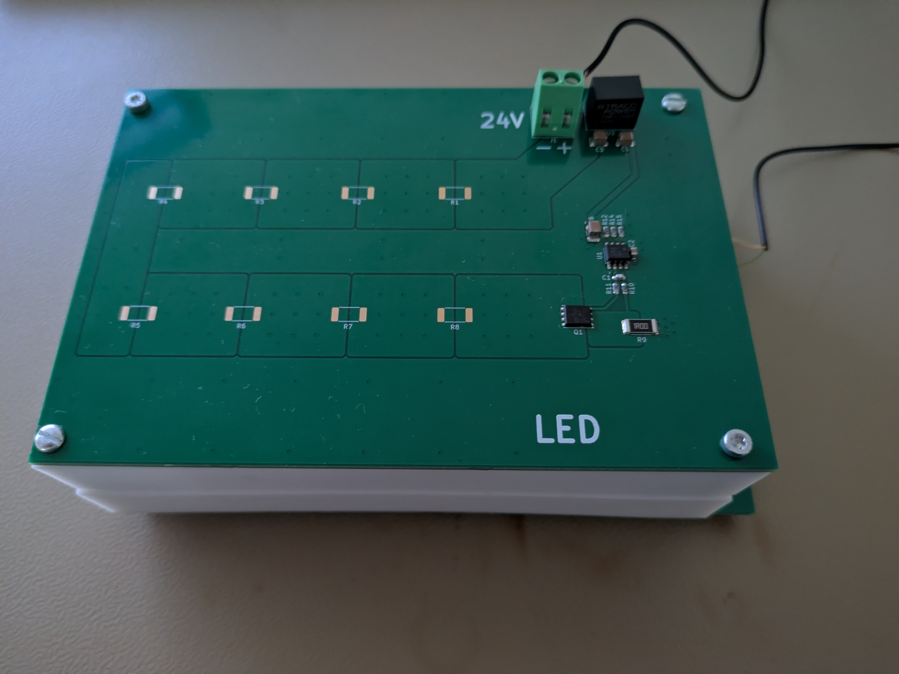

# PMOPC
Poor man's Optical Power Converter

# Introduction
Lately, I have come across the concept of Optical Power Converters (OPC), also known as Photonic Power Converters (PPC), which supply power to circuits using light and fiber optics. This technology is interesting to me for three main reasons: voltage isolation, immunity to common-mode noise and low noise output. For more information about OPC/PPC check : [What is an Optical to Electrical Converter?](https://www.photonics.com/Articles/The-Power-of-Light-Photonic-Power-Innovations-in/a25278). Commercial OPCs can deliver up to 3 W of power. However, the main drawback is that these devices are expensive — with receiver prices starting at approximately 500 euros and transmitters costing around 1,000 euros — and they are not easy to obtain. You can only get [Broadcom](https://www.broadcom.com/products/fiber-optic-modules-components/industrial/optical-power-components) products on on Mouser or DigiKey. A cheap alternative is to use a laser diode, plastic optical fiber, and a photodiode, as described in this paper on isolated sensor networks : [Isolated sensor networks for high-voltage environments using a single polymer optical fiber and LEDs for remote powering as well as data transmission](https://jsss.copernicus.org/articles/7/193/2018/). The downside to this photodiode approach is the limited output power, which is measured only in milliwatts. To overcome these limitations, the solution I would like to test is using infrared LEDs to shine on photovoltaic cells to generate output power.

# Design
Design was done using KiCAD 10.

## LED
Two layer PCB with 8x [SFH 4715AS](https://ams-osram.com/de/products/leds/ir-leds/osram-oslon-black-sfh-4715as) LEDs controlled with a current source.

 

## OPC
Two layer PCB with 2x6 solar cell matrix using [SM111K09L](https://waf-e.dubudisk.com/anysolar.dubuplus.com/techsupport@anysolar.biz/O18Adzr/DubuDisk/www/Gen2/SM111K09L%20DATA%20SHEET%20202007.pdf).

 

# Implementation

I mounted only four solar cells due to the layout of the LED board design. Since each solar cell requires two LEDs and the LED board accommodates a maximum of eight LEDs, four cells is the limit. The 8 LED limits is because I want to use 24V max. 

 

 

# Measurements

## LED-OPC distance 40 mm, LED current 500 mA

 Open Circuit Voltage [V]
| Expected | Measured |
| -------- | -------- |
|**12,44** | **12,18** |

Short Circuit Current [mA]
| Expected | Measured |
| -------- | -------- |
|**93,4** | **90** |

> [!WARNING]
> The voltage will start to drop quickly because of the LEDs' thermal management. At 500 mA, the LEDs will get hot very fast as the PCB design is not optimal for heat dissipation.

## LED-OPC distance 20 mm, LED current 500 mA

 Open Circuit Voltage [V]
| Expected | Measured |
| -------- | -------- |
|**12,44** | **12,31** |

Short Circuit Current [mA]
| Expected | Measured |
| -------- | -------- |
|**93,4** | **96** |

> [!WARNING]
> The voltage will start to drop quickly because of the LEDs' thermal management. At 500 mA, the LEDs will get hot very fast as the PCB design is not optimal for heat dissipation.

## LED-OPC distance 40 mm, LED current 260 mA

 Open Circuit Voltage [V]
| Expected | Measured |
| -------- | -------- |
|**12,44** | **11,62** |

Short Circuit Current [mA]
| Expected | Measured |
| -------- | -------- |
|**93,4** | **49** |

> [!NOTE]
> The voltage drop is much slower, the LEDs are not getting hot as fast.

## LED-OPC distance 20 mm, LED current 260 mA

 Open Circuit Voltage [V]
| Expected | Measured |
| -------- | -------- |
|**12,44** | **11,87** |

Short Circuit Current [mA]
| Expected | Measured |
| -------- | -------- |
|**93,4** | **53** |

> [!NOTE]
> The voltage drop is much slower, the LEDs are not getting hot as fast.